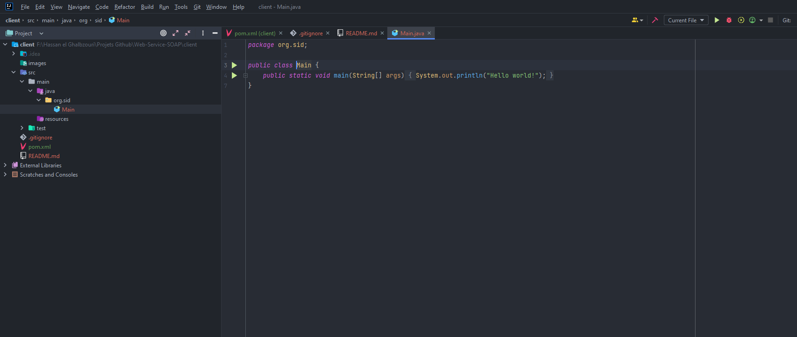
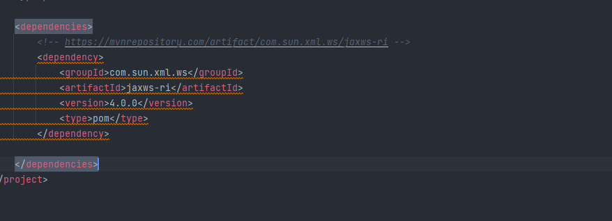
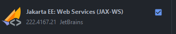
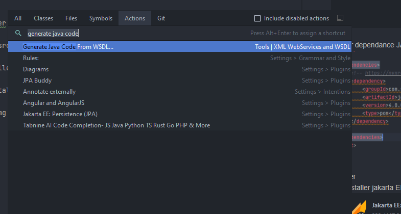
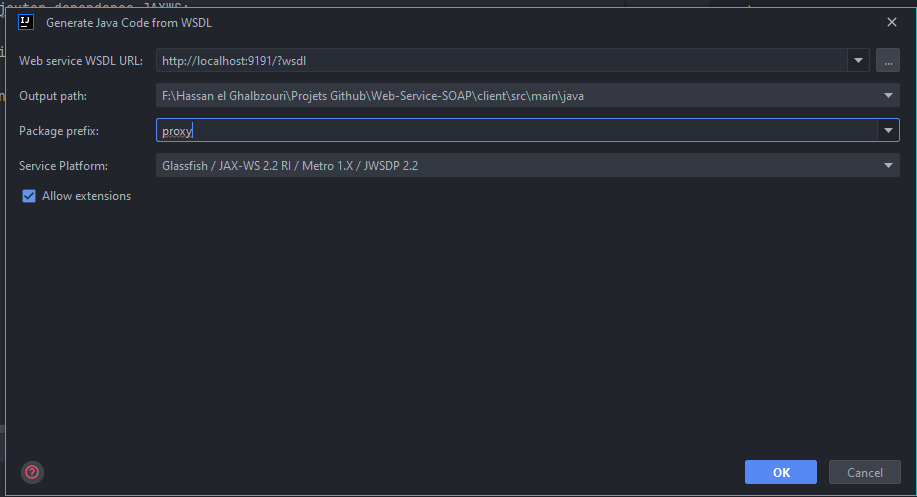
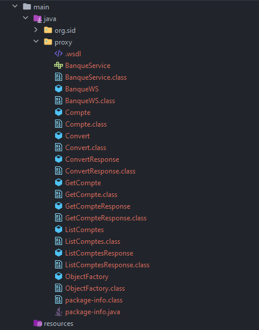

### Web Service SOAP :

1. initializer le projet :

   

2. ajouter dependance JAXWS:
   
   

3. generation de proxy 
   
   * installer jakarta EE:Web Services (JAX-WS): 
       
      

   * selectionner src > clicker sur help > find action > selectionner : generate java code from WSDL 

      

   * ajouter wsdl url

      

   * proxy

       
     
    
    