### Web Service SOAP :

1. initializer le projet :

   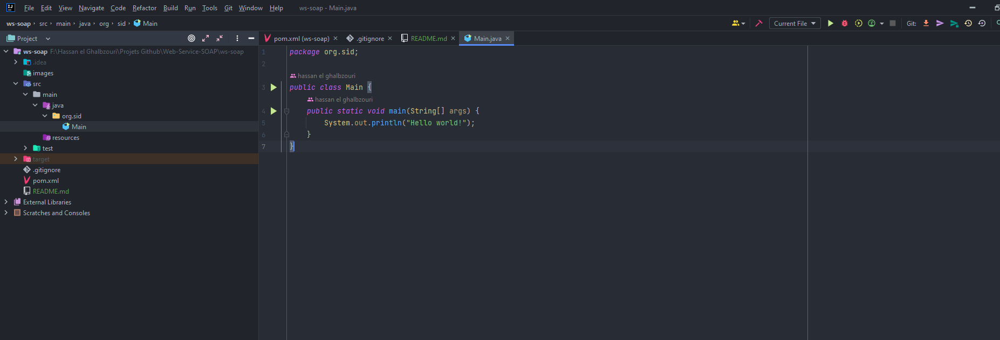

2. ajouter dependance JAXWS:
   
   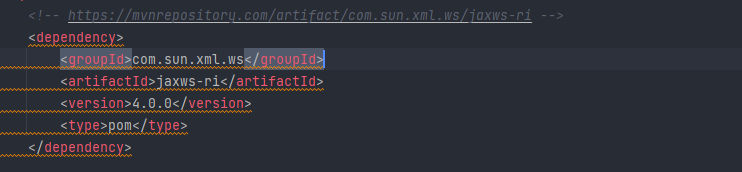

3. creation d'un class POJO BanqueService et Compte  dans un folder ws: 
   * class BanqueService :
      
      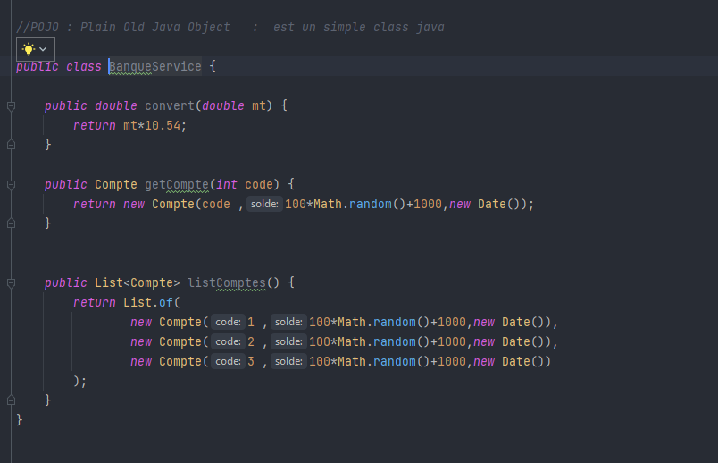
   
   * class Compte :
      
      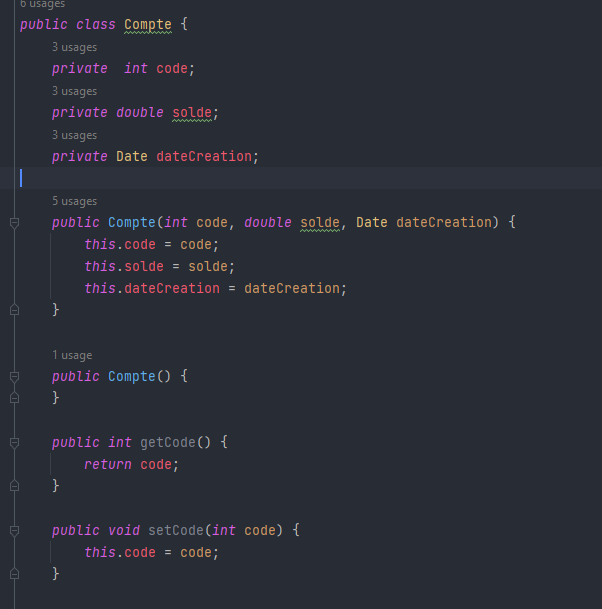
      
   * folder : 
      
      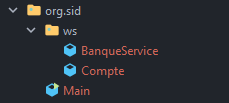

4. creation de webservices :
    
    * ajouter les annotations au BanqueService : 
        -  annotation WebService : concerne la classe (ajouter ServiceName pour specifier le nom de service)
        -  annotation WebMethod : concerne les méthodes (ajouter operationName pour specifier le nom de l'operation)

       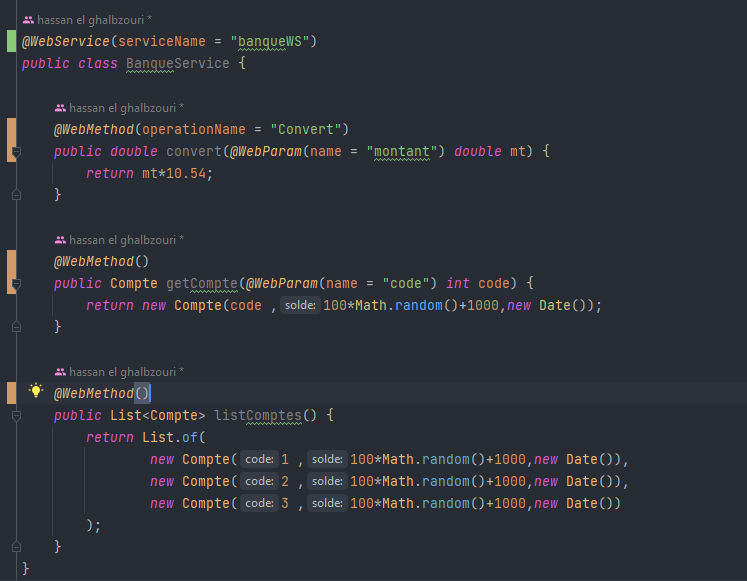
    

    
5. création de serveur JaxWS :

    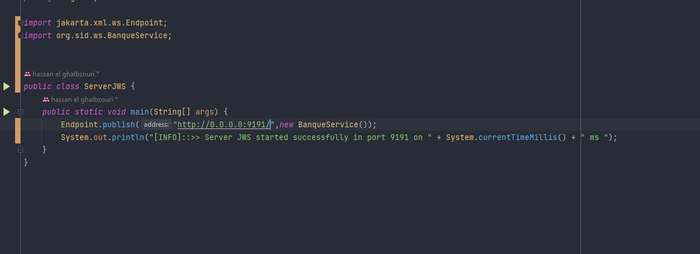
    
    * wsld :

        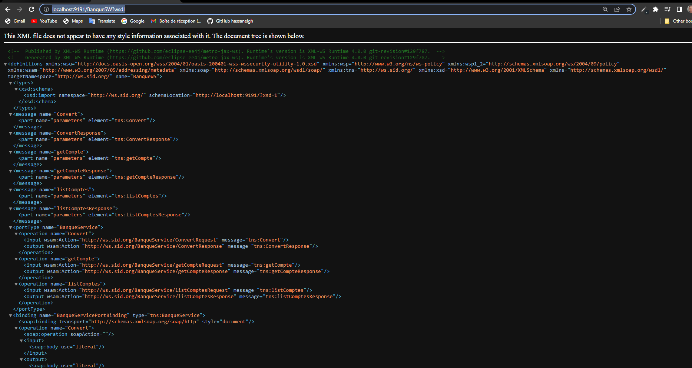

    * xsd : 

        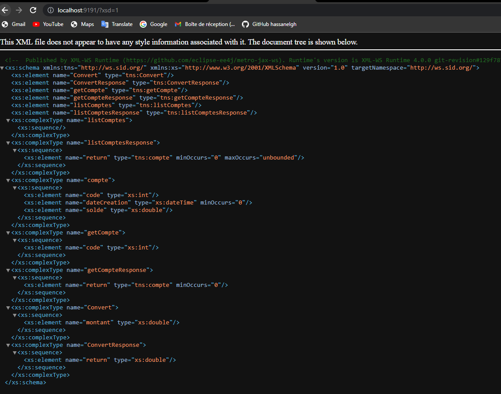
    
    * tester par SoapUI :
      
       - creer project :

            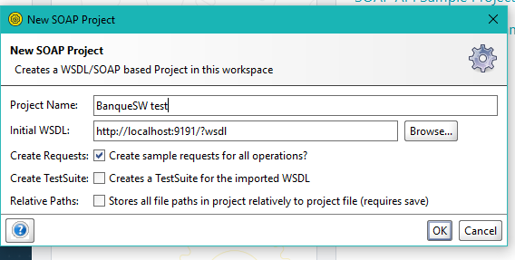

       - test Convert :

            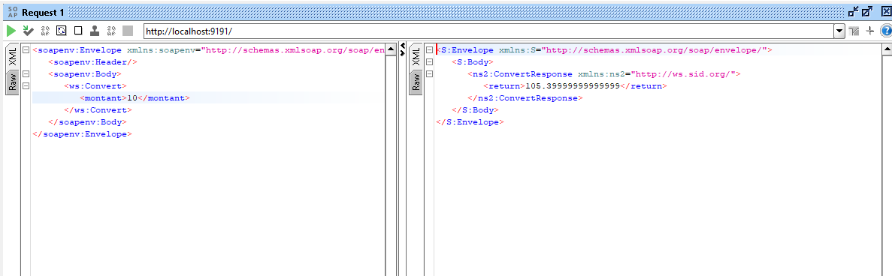

       - test getCompte :

            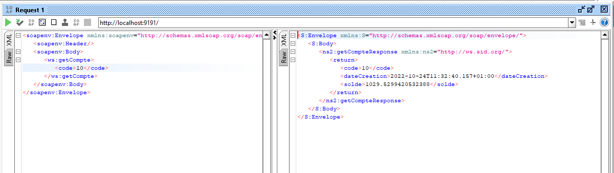
      
       - test listComptes :

            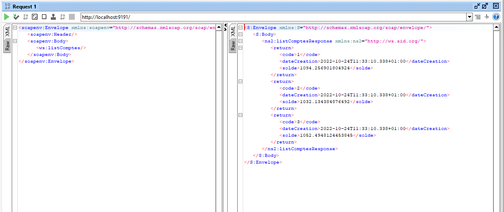

6. serialization de classe Compte :  (on utilise JaxB pour faire la convertion de Java à XML et l'inverse )

   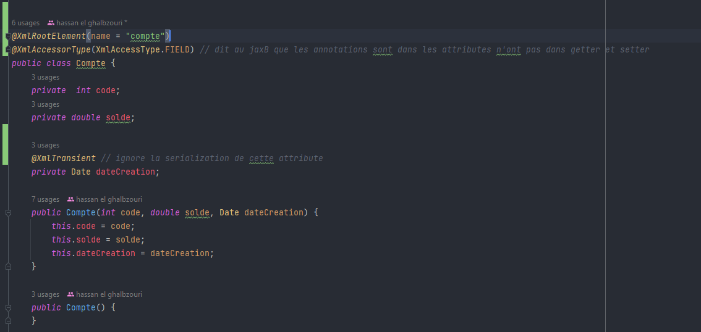

